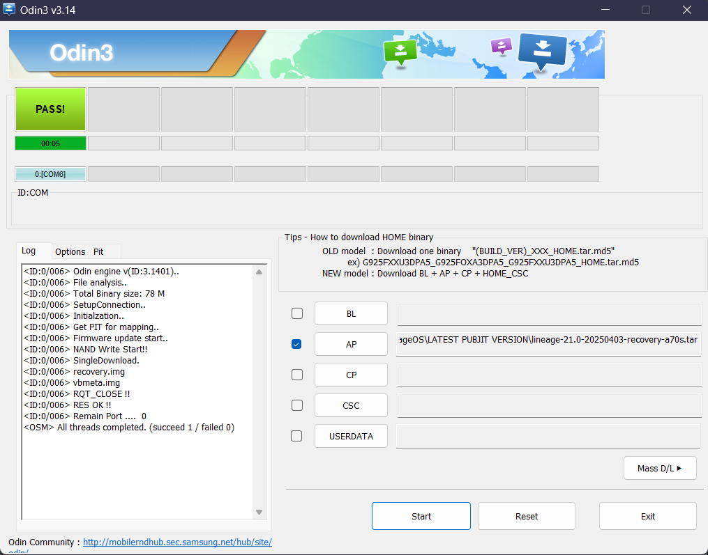
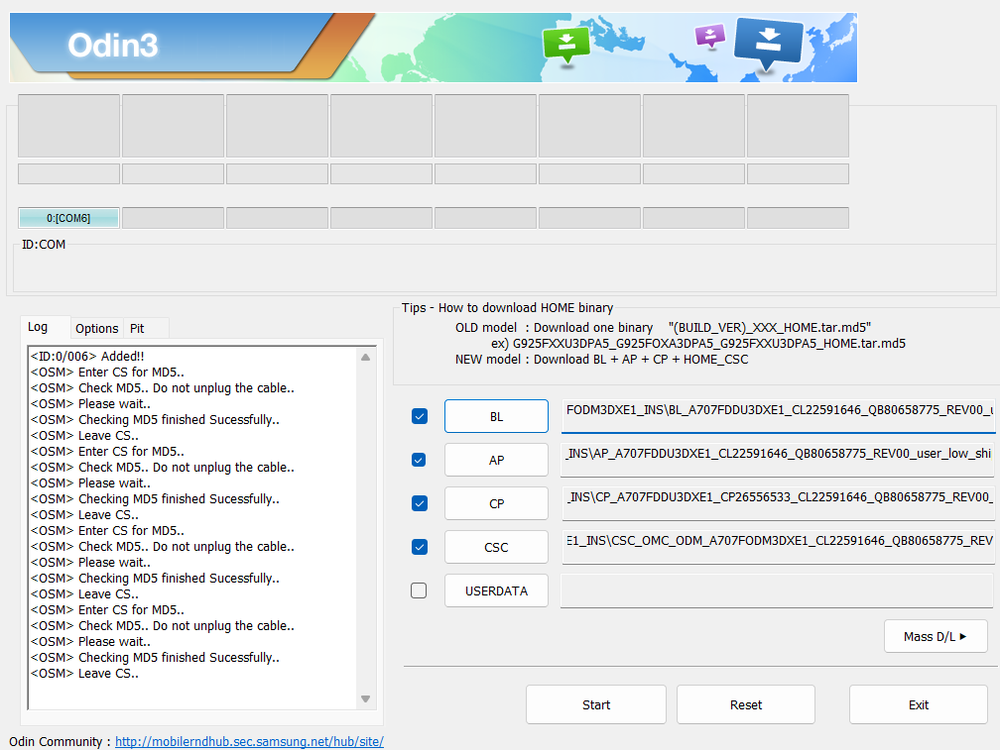

# Samsung A70s Rooting Kit

This repository provides a complete rooting kit for the Samsung A70s (SM-A707F variant) running **LineageOS 21**.  
It includes all necessary tools and files to root your device safely and efficiently.

## 📦 Included in the Kit

- **Booting Files** (Recovery + Boot image)
- **Magisk Modules** (Required modules for Magisk)
- **Odin Software** (Proprietary software for modifying Samsung recovery)
- **Misc Apps** (Google apps and others)

## ⚠️ Warnings and Risks

- Rooting **will void your warranty**.
- There's a **risk of bootloop** if instructions are not followed carefully.
- **Backup your data!** This process may require a factory reset.
- This kit is **only for Samsung A70s (SM-A707F)** running **LineageOS 21**.  
  Using it on other devices or firmware versions may cause irreversible damage.

## ⚙️ Installation Sections

- [Prerequisites](https://github.com/daivik007/Rooting-A70s#prerequisites)
- [Flashing LineageOS Recovery](https://github.com/daivik007/Rooting-A70s#flashing-lineageos-recovery)
- [Flashing LineageOS ROM](https://github.com/daivik007/Rooting-A70s#flashing-lineageos-rom)
- Installing Magisk and Magisk Modules
- Useful modules
- Uninstallation

## Prerequisites

1. Make sure your phone is on the latest firmware for your region. In this case, it is Android 11.
2. A Windows machine.
3. Download required files from [Release](https://github.com/daivik007/Rooting-A70s/releases/new).

### To unlock bootloader

- Go to Settings > About Phone > Software information > Click **Build Number** a couple of times
- This should enable **Developer options** for your samsung device after entering your password.
- Go in Developer options > **Enable OEM unlocking**.

## Flashing LineageOS Recovery

1. Shutdown your phone.
2. Hold `Vol+` and `Vol-` and connect your phone to a PC.
3. Click volume up to continue the process on warning page.
4. Now your device is in **Download Mode**.  
   _For verification, FRP Lock and OEM Lock should be OFF and KG STATUS should be checking._

5. Open **Odin** and select:
   - `AP` → Select the **Lineage OS recovery** provided.
   - `BL`, `CP`, `CSC` → Leave blank.
6. In Options, only check `F. Reset Time`.
7. Click **Start** and wait for the flash to complete.
8. Now you have your **Recovery** installed succesfully.



## Flashing LineageOS ROM

1. Hold `Vol-` and `Power` to hard restart.
2. Shift to `Vol+` and `Power` to go to **Recovery**.
3. Go to Factory Reset > Format system partition.
4. Then, go to Apply Update > Apply from ADB.
5. From the ADB folder, launch **cmd-here.exe**.

```
adb sideload [local path of custom rom]
```

6. Then again go for applying update from ADB.
7. If signature verification failed, install anyway.

```
adb sideload [magisk.apk path]
```

8. Repeat applying update from ADB

```
adb sideload [MindTheGapps path]
```

9. Reboot. Here it won't reboot and will ask for data reset.
10. Allow data reset and you'll be fine.

## Installing Magisk and Magisk Modules

### Installing Magisk

1. Launch Magisk from app drawer and download the app from toast notification.
2. After rebooting, launch magisk and you should see Magisk icon.
3. Launch Magisk and click **Install** in the Magisk card and select **Direct Install** to install Magisk.
4. After reboot, launch Magisk again and go to it's settings. Enable this:
   - Hide the Magisk app
   - Systemless hosts
   - Zygisk
   - Enforce DenyList
   - User Authentication

### Module Installation

- Download the .zip file of the module
- Go to Magisk > Modules > Install from storage
- Select the .zip package
- Reboot!

### Passing Play Integrity

1. Download PIF, TrickyStore, TrickyStore Addon.
2. Install PIF and reboot.
3. Install TrickyStore and reboot.
4. After reboot, cick on the action button on PIF module.
5. Go to `/data/adb` using [Zarchiver](https://play.google.com/store/apps/details?id=ru.zdevs.zarchiver&hl=en_IN). There you will find a `pif.json` file.
6. Copy that file to `data/adb/modules/playintegrityfix`.
7. Install TrickyStore Addon and reboot.
8. After reboot, click on the action button of `TrickStore` module. this will install KsuWebUI if you do not have KsuWebUI or MMRL installed. KsuWebUI is preferred.
9. Open KsuWebUI and click on Tricky Store.
10. Click on menu > click on `Set Valid Keybox`.
11. Click on menu again > click on `Set Security Patch` > click on `Get Security Patch` > click on `Save`.
12. Done. Now you should have basic, device and strong integrity in both legacy and new response.

_Do not check play integrity too frequently. Do not check at all if not necessary. Because if you check too frequently, Google with get sus._

## Useful Modules

<details>
<summary><h2>Useful Modules</h2></summary>

### 🔹 [PlayIntegrityFix](https://github.com/chiteroman/PlayIntegrityFix)

Files: `relative file location`  
This module tries to fix Play Integrity and SafetyNet verdicts to get a valid attestation.

### 🔹 [TrickyStore](https://github.com/5ec1cff/TrickyStore)

Files: `relative file location`  
This module is used for modifying the certificate chain generated for android key attestation.

### 🔹 [TrickyStore Addon](https://github.com/KOWX712/Tricky-Addon-Update-Target-List)

Files: `relative file location`  
This module is used for configuring Tricky Store target.txt with KSU WebUI.

### 🔹 [playcurlNEXT](https://github.com/daboynb/playcurlNEXT)

Files: `relative file location`  
This is a rewrite of Playcurl, the old version became outdated as many things have changed. Paradoxically, this is more lightweight and easier to use.

### 🔹 [LSposed_mod](https://github.com/mywalkb/LSPosed_mod)

Files: `relative file location`  
A Riru / Zygisk module trying to provide an ART hooking framework which delivers consistent APIs with the OG Xposed, leveraging LSPlant hooking framework.

</details>

## Uninstallation

### Magisk Modules

### Magisk

### Reverting to Stock ROM

1. Connect your phone to a PC with USB.
2. Enable USB Debugging
   - Go to settings
   - Scroll down to About Phone
   - Scroll down to Build number
   - Click it several times and you should have developer options enabled.
   - Go to system > Developer options
   - Under debugging, enable USB debugging and Rooted debugging.
3. Install **Samsung USB Drivers** from the repository.
4. Keep the **Stock Firmware** folder ready.
5. Launch the **Odin** tool.
6. Now under the **ADB** folder, launch **cmd-here.exe** and type

```
adb reboot download
```

7. Now in Odin, you should see `<ID:0/006> Added!!` in the log
8. For adding files, select the appropriate files that matches the name from the **Stock Firmware** folder
9. In `CSC`, add CSC_OMC_ODM file.



10. Now just hit Start and you are good to go!

_It should only take 1-2 reboots to get to boot up the OS. If it takes more than that, consider your phone in a bootloop. Head over to this [video](https://www.youtube.com/watch?v=SL6IoYwI8Kg) to get out of bootloop._

## 🙏 Credits

- [LineageOS](https://lineageos.org/)
- [Magisk by topjohnwu](https://github.com/topjohnwu/Magisk)
- [TWRP Recovery](https://twrp.me/)
- Special thanks to all open-source developers who made this possible.

---

## 📜 License

This project is released with respect to the licenses of included open-source projects.  
Please refer to their respective licenses for usage guidelines.
